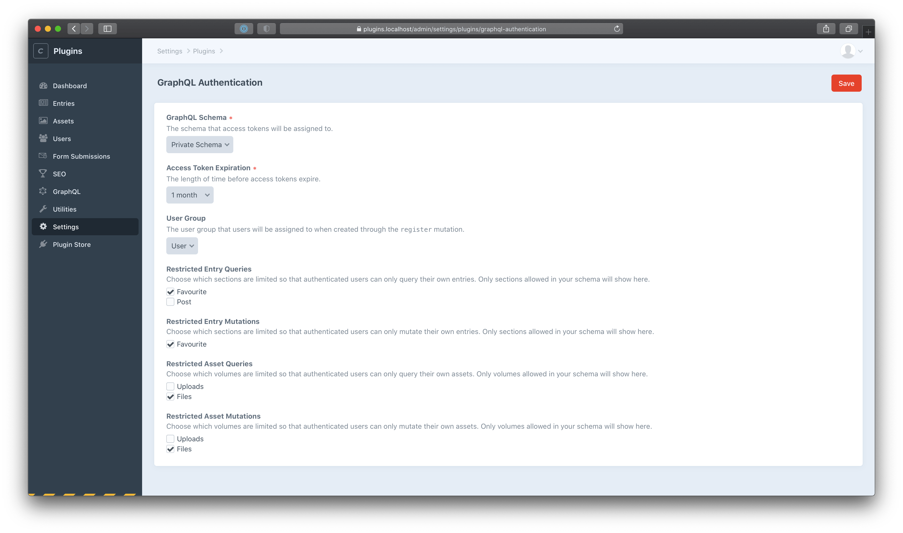

# GraphQL Authentication plugin for Craft CMS 3.5+

GraphQL Authentication for Craft adds an authentication layer to your GraphQL endpoint. It:

- Adds mutations for all user-related actions (registration, log in, update user, and more)
- Allows you to define per-section user restrictions (queries and mutations can be limited to author-only)
- Checks mutation fields against schema permissions, and prevents fields being saved if using private entries/assets

## Requirements

This plugin requires Craft CMS 3.5 or later.

## Installation

To install the plugin, follow these instructions.

1.  Open your terminal and go to your Craft project:

        cd /path/to/project

2.  Then tell Composer to load the plugin:

        composer require jamesedmonston/graphql-authentication

3.  In the Control Panel, go to Settings → Plugins and click the “Install” button for GraphQL Authentication.

## Configuring GraphQL Authentication



Once you've got the plugin installed, there are a few things that you'll need to tweak to get up and running:

### Schema

First up, create a separate schema for users with the desired permissions. This schema will be assigned to user tokens upon authentication.

Once you're happy with your schema, head to the plugin settings (Settings → GraphQL Authentication) and select it.

### Token Expiration

Now you've got your schema set up, you'll need to set how long you'd like your tokens to be valid for – the default is indefinite.

If requests are made with an expired token, responses will `throw` with `Invalid Authorization Header`.

### User Group

If users will also have access to the Craft control panel, you can choose which user group they will be assigned to at registration time.

### Restrictions

Finally, here's where you'll define which sections should be restricted so that queries/mutations are only allowed to fetch/modify the currently authenticated user's entries/assets.

Sections and volumes that have read or write access in your schema will show here.

## Using GraphQL Authentication

Hopefully by this point you've got everything installed and configured as needed, and you're ready to start to get started!

### Mutations

We offer the following mutations for handling user authentication:

- [`authenticate`](#authenticate-mutation)
- [`register`](#register-mutation)
- [`forgottenPassword`](#forgottenpassword-mutation)
- [`setPassword`](#setpassword-mutation)
- [`updatePassword`](#updatepassword-mutation)
- [`updateUser`](#updateuser-mutation)
- [`deleteCurrentToken`](#deletecurrenttoken-mutation)
- [`deleteAllTokens`](#deletealltokens-mutation)

#### `authenticate` mutation

Logs a user in.

Use the token returned here as your `Authorization` header to sign subsequent calls (e.g. `Authorization: Bearer {tokenValue}`).

Publically available. Does not require `Authorization` header.

```
mutation {
  authenticate(
    email: "james@testingthings.com"
    password: "testing123"
  ) {
    accessToken
    user {
      id
      fullName
    }
  }
}

// returns
{
  "data": {
    "authenticate": {
      "accessToken": "CsLPaT2452N0lvreGzAGsha8vVfP1nSc",
      "user": {
        "id": "360",
        "fullName": "James Edmonston"
      }
    }
  }
}
```

#### `register` mutation

Registers a user.

Use the token returned here as your `Authorization` header to sign subsequent calls (e.g. `Authorization: Bearer {tokenValue}`).

Publically available. Does not require `Authorization` header.

```
mutation {
  register(
    email: "james@testingthings.com"
    password: "testing123"
    firstName: "James"
    lastName: "Edmonston"
    // also supports custom fields
  ) {
    accessToken
    user {
      id
      fullName
    }
  }
}

// returns
{
  "data": {
    "register": {
      "accessToken": "St6ED_mLkIKW2VCOqi91nJfztlSGysgU",
      "user": {
        "id": "360",
        "fullName": "James Edmonston"
      }
    }
  }
}
```

#### `forgottenPassword` mutation

Sends a password reset email to the user's email address.

Publically available. Does not require `Authorization` header.

```
mutation {
  forgottenPassword(email: "james@testingthings.com")
}

// returns
{
  "data": {
    "forgottenPassword": "You will receive an email if it matches an account in our system"
  }
}
```

#### `setPassword` mutation

Sets password for unauthenticated user.

Publically available. Does not require `Authorization` header.

```
mutation {
  setPassword(
    password: "testing1234"
    code: "aY6MHG5NhKvA5tzrxKXuAvOLKca3fjJQ" // `code` query param from reset password email
    id: "b50acbd9-c905-477a-a3f5-d0972a5a4356" // `id` query param from reset password email
  )
}

// returns
{
  "data": {
    "setPassword": "Successfully saved password"
  }
}
```

#### `updatePassword` mutation

Updates password for authenticated user.

Requires valid `Authorization` header.

```
mutation {
  updatePassword(
    currentPassword: "testing123"
    newPassword: "testing1234"
    confirmPassword: "testing1234"
  )
}

// returns
{
  "data": {
    "updatePassword": "Successfully updated password"
  }
}
```

#### `updateUser` mutation

Updates authenticated user.

Requires valid `Authorization` header.

```
mutation {
  updateUser(
    firstName: "Jerry"
    lastName: "Jackson"
    // also supports custom fields
  ) {
    id
    fullName
  }
}

// returns
{
  "data": {
    "updateUser": {
      "id": "359",
      "fullName": "Jerry Jackson"
    }
  }
}
```

#### `deleteCurrentToken` mutation

Deletes authenticated user access token. Useful for logging out of current device.

Requires valid `Authorization` header.

```
mutation {
  deleteCurrentToken
}

// returns
{
  "data": {
    "deleteCurrentToken": true
  }
}
```

#### `deleteAllTokens` mutation

Deletes all access tokens belonging to the authenticated user. Useful for logging out of all devices.

Requires valid `Authorization` header.

```
mutation {
  deleteAllTokens
}

// returns
{
  "data": {
    "deleteAllTokens": true
  }
}
```

### Queries

We offer the following queries for pulling user data:

- [`getUser`](#getuser-query)

#### `getUser` query

Gets authenticated user.

Requires valid `Authorization` header.

```
query {
  getUser {
    id
    fullName
  }
}

// returns
{
  "data": {
    "getUser": {
      "id": "360",
      "fullName": "James Edmonston"
    }
  }
}
```
